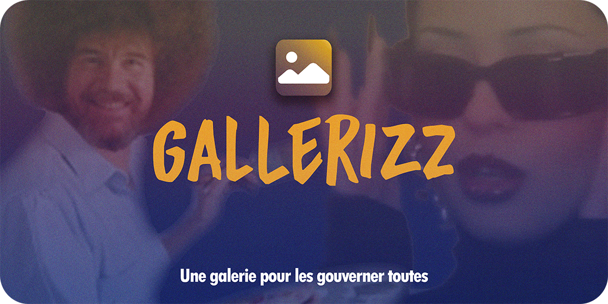

  

  <a href="https://github.com/Pardaramskha/gallerizz/releases/latest/download/Gallerizz-Setup.exe"><b>Télécharger Gallerizz pour Windows</b></a>
  &nbsp;·&nbsp;
  <a href="https://github.com/Pardaramskha/gallerizz/releases/latest/download/Gallerizz-portable.zip">version portable (zip)</a>

# Gallerizz

Marre que vos galeries ne lisent pas tous les fichiers ? Marre qu'on vous demande de sauvegarder les photos floues prises à 5h du mat sur le cloud ? Marre que vos GIFs de canard ne puissent être lus que sur chrome ? Cette app est faite pour vous.

Gallerizz, c'est une galerie. Point barre.

Elle lit tous les formats image que je connais, tout simplement. Pas besoin de connexion web, pas de surplus de fonctionnalités, pas de furetage dans les données ou d'indexation cachée.

> [!WARNING]
> **Avertissement lié à l'IA**
>
> Je suis ingé logiciel web, et ça se limite à ça. Ce logiciel a été créé en grande partie avec le support de l'IA, puis débuggué manuellement et vérifié sous toutes les coutures. Ce projet est un projet fun, non pas un projet à visée performative ou professionnelle - traitez-le en conséquence, et continuez d'avoir un usage prudent et raisonnable des outils d'intelligence artificielle.

## Installation

Là où vous voulez. 

[Téléchargez l'installeur](https://github.com/Pardaramskha/gallerizz/releases/latest/download/Gallerizz-Setup.exe) : il va créer un dossier là où il se trouve, donc créez-vous un petit dossier dont vous vous souviendrez dans documents/ ou downloads/, et déballez l'app.

> [!WARNING]
> **Votre antivirus va gueuler**
>
> Qui a 300 balles à lâcher par an pour un certificat d'authentification de l'app ? Pas moi, en tous cas. Lorsque vous téléchargerez ou installerez l'app, vous aurez probablement un avertissement. Soyez fermes avec lui !

## La définir par défaut

Lorsque vous devez sélectionner une application de lecture par défaut pour un format X ou Y d'image, cliquez simplement sur gallerizz.exe dans le dossier d'installation de l'app. 

Ta-Dah.

Si vous supprimez le dossier d'installation de l'app, il vous faudra redéfinir un logiciel de lecture par défaut. Sad.

## Les deux-trois choses à savoir

| Raccourcis | Effet |
| --- | --- |
| Echap  | Ferme la session actuelle de l'app  |
| Flèche gauche/flèche droite  | Navigation  |
| Molette/Scroll  | Zoom  |
| I  | Informations de l'image  |
| F  | Plein écran  |
| B  | Changer la couleur de l'arrière-plan (blanc/gris/anthracite)  |
| Ctrl + C  | Copier l'image dans le presse-papiers  |
| Suppr  | Supprimer l'image  |

## Vous en voulez davantage ?
Les issues github sont aussi là pour ça. Gueulez-moi dessus un bon coup pour que je rajoute des choses dedans, et je vous écouterai (I guess).

## Licence

Faites ce que vous voulez avec ça, I don't care.

Formellement : [WTFPL](LICENSE).

